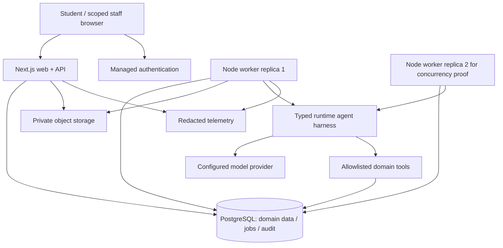
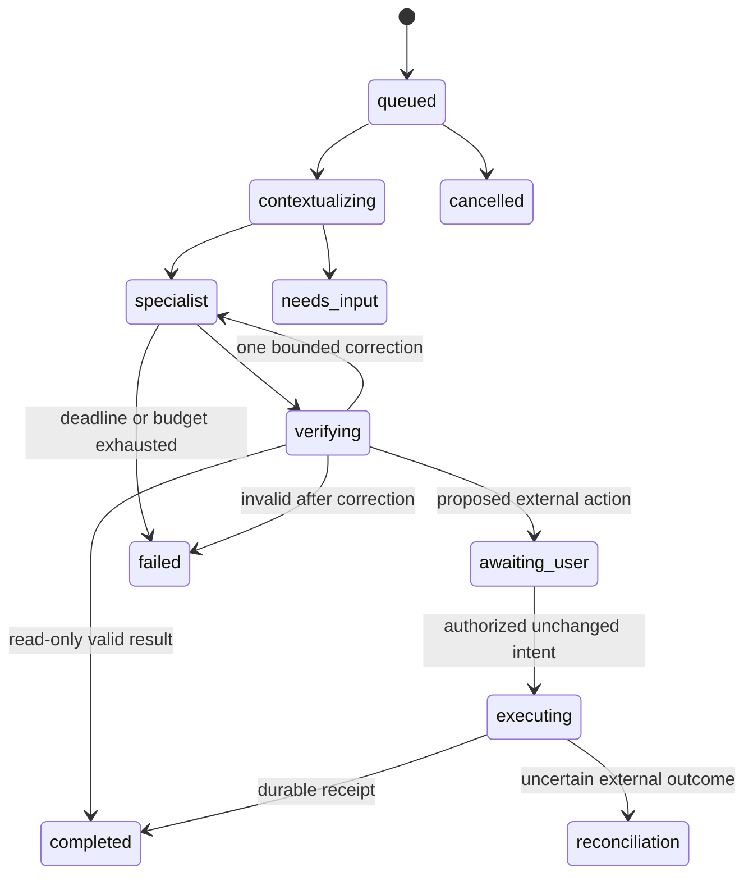

# Distributed and multi-agent architecture

This is an implementation specification. The diagrams describe the system to build, not running infrastructure.

## Deployment boundaries



Web accepts authenticated operations and returns quickly. Worker performs extraction, retrieval, AI analysis, and reminders asynchronously. PostgreSQL is authoritative for domain data and durable work. Object storage contains private uploads. One web instance and one worker are sufficient for evaluation; launch a second worker during concurrency tests. This is distributed execution, but a single database/provider remains a shared failure dependency. Do not claim high availability until failover and redundancy are actually configured and tested.

Use a modular monorepo:

```text
apps/web/                 Next.js UI, route handlers, session boundary
apps/worker/              queue runner, ingestion, reminders, AI runs
packages/domain/         services and deterministic business rules
packages/contracts/      Zod request/result/event contracts
packages/db/             migrations, repositories, tenant scope
packages/ai/             prompts, specialist steps, provider boundary
packages/ui/             shared components only when actually reused
tests/integration/       database, access, queue and adapter tests
tests/e2e/               four student journeys and staff workflow
evals/                   versioned synthetic AI cases and scoring
infra/                   container and hosting configuration
```

Choose supported runtime and package versions during T01. Avoid module scaffolds with no immediate ticket consumer.

## Durable job protocol

1. In the same database transaction, write domain intent and insert a job. A complaint submission transaction creates the complaint, audit event, and notification job together. A unique request key prevents duplicate submissions.
2. Workers claim a due job in a short transaction using row locking and `SKIP LOCKED`; increment `attempt` and `lease_generation`, set `locked_until` and `worker_id`, then commit. Never hold a database transaction open during a model/network call.
3. Heartbeat the lease while working. Suggested starting values: 60-second lease, heartbeat every 15 seconds, maximum 120-second model step. Measure before tuning.
4. Persist step result and next state using compare-and-swap on `lease_generation` and workflow version. An expired/stale worker may not finalize state. Provider calls cannot always be fenced; budget for duplicate inference after crashes.
5. Mark success only after durable results exist. Retry transient network/429/5xx errors with jitter and at most three attempts, honoring provider retry hints within the run deadline. Validation/auth/permanent errors terminate immediately.
6. On exhausted retries, move to failed/dead-letter state with a sanitized reason and operator retry action. Retrying creates a linked attempt, preserving audit history.
7. A recovery sweep requeues expired leases. A unique deduplication key prevents duplicate reminders/complaints. Cancellation is checked before every new step and immediately before side effects; already accepted external effects may not be cancellable.

Delivery semantics are **at least once**. Exactly-once external effects are not promised. For a provider supporting idempotency keys, persist and reuse its key; after timeout, query/reconcile external receipt before resending. If delivery outcome is unknown and the provider cannot deduplicate, mark `delivery_unknown` and ask the operator to reconcile. Never send blindly on retry. Tuesday email defaults to a test sink.

For this queue, the job table itself is the transactional outbox; there is no extra broker to publish to. If a broker is added later, add an explicit outbox relay and consumer deduplication rather than committing DB writes and broker messages independently. PostgreSQL describes the locking mechanism and its queue tradeoff in [SELECT](https://www.postgresql.org/docs/current/sql-select.html).

Partition logical ordering by aggregate ID (complaint/run), enforce expected aggregate version, and reject out-of-order state transitions. Do not depend on global job order. Store UTC timestamps; calculate deadline boundaries from each college's configured timezone. Avoid relying on a worker machine's local clock.

Backpressure: per-user active AI job cap 2, per-college quota, global worker concurrency initially 2, upload byte/page limits, bounded polling, maximum queue age alert. If saturated, return a retryable response or queued estimate; never spawn unlimited model calls. Multi-instance quota reservations use a transactional database record, not an in-memory counter.

## Runtime agents

An agent here is a separately instructed, typed specialist step with a constrained tool set. Several agents can run in the same worker process. Agents do not need separate services or independent database credentials.

| Role | Input and result | Allowed tools | Forbidden responsibility |
|---|---|---|---|
| Router | Intent + active screen -> specialist or clarification | No model tools; prefer deterministic screen/intent routing | Authorizing identity or writes |
| Scholarship specialist | Scoped records + policy excerpts -> evidence, possible cause, complaint draft | Read fees/status, policy search, department directory, draft tool | Claiming government credit, editing payments, choosing arbitrary email recipients |
| Learning specialist | Selected curriculum + question + retrieved chunks -> cited teaching response | Academic retrieval, approved paper lookup | Reading finances/resumes, executing arbitrary code |
| Career specialist | Approved resume facts + JD -> gaps, suggested edits, training next steps | Resume parse result, job lookup, deterministic match helpers | Inventing achievements, asserting guaranteed hiring probability |
| Verifier | Candidate output + tool receipts -> pass/reject/revise | Schema/citation/permission/state checks | Treating another model's opinion as financial proof |
| Action executor | User-approved intent -> committed result/receipt | Explicit domain command allowlist | Accepting tools/SQL/URLs invented in retrieved content |

Tuesday uses three actual specialist model prompts, a deterministic router, a deterministic verifier, and a service-layer executor. Do not add extra model calls merely to give every stage an agent name. A second model review is optional for uncertain answer quality, not a security boundary.

## Workflow and contracts



All active states also support recorded failure/cancellation where no completed side effect prevents it. A complaint may be submitted explicitly through the UI even while conversational AI is unavailable.

`RunContext`: `run_id`, server-derived `college_id`, `actor_id`, `role_scope`, `intent`, `scope_ids`, `source_versions`, `consent_ref`, `deadline_at`, `budget_reservation_id`, `trace_id`. Do not allow the model or browser to overwrite identity fields.

`AgentResult`: `schema_version`, `answer`, `claims[{text,source_ids}]`, `uncertainties[]`, `proposed_action?`, `missing_inputs[]`. `ToolResult`: `status`, `evidence_refs[]`, `record_version`, `observed_at`, `receipt_id?`. Validate all outputs before use; on invalid JSON allow one repair, then fail safely.

Proposed action includes canonical target IDs, normalized body, an intent hash, and expiry. User approval is bound to actor, tenant, action content hash, and current record version. Edits, changed recipients, stale data, or expired approval require renewed review. Backend reauthorizes at execution time, including queued jobs after role revocation.

Starting budgets, to be tuned: at most 4 model calls/run including repairs; at most 8 tool calls; 120 seconds per interactive run; at most 12k input and 2k output tokens per call subject to the chosen model's limits. Reserve cost before execution; hard-deny new work when tenant or global caps are reached. Record provider usage and reconcile reservations on completion, cancellation, and crash recovery. Treat these as proposed caps, not established price estimates.

## Context and retrieval

Do not assemble the entire student profile for every question. Financial specialist gets financial records and scholarship policies; tutor gets academic scope; career specialist gets authorized career data. Retrieve tenant/subject/regulation/version-filtered content **before** similarity ranking. Re-check source access when displaying citations/download links.

Ingestion: upload to quarantine -> content signature/limits check -> malware scan where uploads are enabled -> bounded text extraction -> staff review for academic publication -> chunk with page/section provenance -> embed -> publish one active version transactionally. Tuesday can seed manually approved text plus original sample documents if the scanner/OCR path is unavailable; disable arbitrary upload rather than pretending it is scanned.

Suggested retrieval baseline: heading-aware chunks around 500-800 tokens, modest overlap, keyword plus vector retrieval, top 5-8 chunks, exact source identifiers and page boundaries. These values need evaluation. Store embedding model/version/dimension with the index; re-embedding a new model is a versioned migration. Deletion/unpublishing invalidates chunks and cached answers. Text extraction failure is visible; scanned PDFs require an OCR path later or manual text entry now.

Source precedence: authorized latest transactional record for balances/status; current approved college policy for deadlines/requirements; approved syllabus/material for academic answers; user-confirmed resume facts for achievements; verified listing for job details. Conflicts produce uncertainty with timestamps, not a guessed fact. General educational knowledge can be labeled supplemental; it must not masquerade as a source citation.

Cache only with tenant, user scope where relevant, source version, prompt/model version, and selected curriculum in the key. Never share private student answers across users. No raw hidden model reasoning is needed in logs: store concise decisions, citations, tool actions, and receipts.

## Required distribution tests

Kill worker after claim and before completion; recover expired lease. Run two workers on the same jobs; only one durable effect per dedup key. Crash after DB commit before response; repeated browser request returns same receipt. Simulate provider timeout after sending; enter reconciliation. Revoke membership while run is queued; execution denies access. Cancel while running; no later new effects. Restart web; queued results still visible. Drop database connectivity; readiness fails and no false success is returned.
