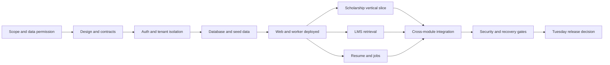

# Implementation plan

## 1. Outcome and honesty about the deadline

The product is a student support platform connecting **financial support, learning, career preparation, and job discovery** through scoped context retrieval, specialist AI steps, controlled tools, and evidence-based verification.

You are one developer using Claude Code and Codex. Assume a Tuesday **6 October 2026, 14:00 IST** handoff. Budget roughly 22 focused working hours, 8 hours of sleep, and the remaining time for meals, account setup, unexpected failures, and release buffer. This is a planning estimate, not a guarantee.

The deadline can support a narrow hosted evaluation pilot. Full institutional production readiness depends on work outside coding: source access, data-owner approval, role mapping, privacy terms, security testing, and recovery proof. If these are missing, deploy with synthetic data and invite-only access. Do not label it safe for real student financial data merely because it deploys.

## 2. Concrete Tuesday scope

| Area | Tuesday implementation | Later expansion |
|---|---|---|
| Identity | Invite-only accounts; student and scoped staff roles; two synthetic colleges for isolation tests | Institutional SSO, lifecycle provisioning, enrollment integration |
| Fees | Read-only per-year/category balance, paid, due, source timestamp | Live ERP synchronization, refunds/reconciliation, policy-driven penalties |
| Scholarships | Approved/released/credited distinction; checklist; complaint draft, explicit submit, staff timeline | Government connectors, institution-specific eligibility engines, external department delivery |
| LMS | Versioned CSE sample curriculum, two subjects including one prior-semester backlog, cited tutoring, paper list/download | Complete authorized branch curricula, exam frequency analysis, richer practice |
| Career | Text resume entry and PDF upload; extraction; JD comparison; evidence-backed suggestions; basic training next steps | Resume export/builder, full assessments, recruitment training, interview coaching |
| Jobs | Staff-curated IT/non-IT, campus/off-campus/fresher/internship listings; filters; deadline; JD-to-resume flow; official application links | Licensed feeds, freshness automation, personalized reminders |
| AI | Router, three specialists, deterministic verifier, durable run state and per-run limits | Calibrated evaluation corpus, advanced orchestration only if justified |
| Distribution | Separate hosted web and worker processes; PostgreSQL-backed durable queue; two-worker concurrency proof | Higher availability, separate worker pools, capacity-based scaling |
| Administration | Seed/import synthetic records, manage content/jobs, handle complaints | Full institutional import UI, audited bulk operations, operational dashboards |

Reminders on Tuesday: one scheduled in-app reminder job, preferences, suppression after resolution/payment, and deduplication. Email stays in a test inbox unless a verified sending integration and explicit action authorization exist. No payment collection, auto-job applications, autonomous financial corrections, or code execution service in this release.

## 3. Proposed stack and why

- **TypeScript throughout**, Next.js/React web and server endpoints, independent Node.js worker, schema validation with Zod. One language reduces solo-development overhead.
- **Supabase managed PostgreSQL, Auth, private Storage**, with pgvector only for academic document retrieval. All business operations pass through server services; browser access is limited to authentication and tightly scoped signed upload/download flows.
- **PostgreSQL durable jobs**, claimed with short `FOR UPDATE SKIP LOCKED` transactions. No Redis/Kafka dependency on Tuesday. This is a work queue, not a globally ordered event log; implement and test the lease/idempotency details in the architecture document. PostgreSQL documents queue-oriented use of this locking option in [SELECT](https://www.postgresql.org/docs/current/sql-select.html).
- **One official model SDK first** (OpenAI or Anthropic, whichever account already works), behind a tiny typed provider boundary. Claude Code and Codex are build tools; they are not the deployed student's runtime. Configure model IDs and budgets rather than hard-coding a guessed latest model. Add another runtime provider only after compatibility evaluations.
- **Render web service and background worker**, same region as the database where feasible. These are separate deployable processes. Render documents this worker execution model in [Background Workers](https://render.com/docs/background-workers). Verify plan availability and pricing before provisioning.
- **Vitest, Playwright, SQL integration tests**, structured logs and an error tracker with PII scrubbing. GitHub Actions for repeatable gates.

These are proposed decisions, not mandates in the PDFs. Resolve dependency versions at scaffold time using official docs and the installed runtime. Commit lockfiles and a runtime version declaration. Avoid moving to a second backend language or complex orchestration framework during this deadline.

## 4. Dependency order

The branches show dependencies, not a requirement to run coding agents concurrently. As a solo developer, complete them sequentially and use the other assistant for bounded reviews.

## 5. Timeboxed execution

| Window, IST | Work | Required stop condition |
|---|---|---|
| Mon 00:45-01:30 | Read kit, choose existing accounts, approve Tuesday cut line | Scope and data mode recorded; runtime key available or AI explicitly blocked |
| Mon 01:30-08:00 | Rest | Protect the next working day |
| Mon 08:00-10:00 | Tickets T01-T03: shell, contracts, auth/schema | Two test tenants isolated; no student can grant themselves staff role |
| Mon 10:00-11:30 | T04: queue/worker; deploy thin shell | Hosted worker completes persisted test job after restart |
| Mon 11:30-14:00 | T05-T06: fees, scholarship, complaint flow | End-to-end saved complaint with receipt and staff update |
| Mon 14:00-14:30 | Break and contingency | Reassess critical path |
| Mon 14:30-17:00 | T07-T08: authorized material ingestion and tutor | Cited answer in selected curriculum, abstention on missing source |
| Mon 17:00-19:00 | T09-T10: resume and job workflow | Resume analysis saved; job-to-resume flow returns correct job |
| Mon 19:00-20:00 | Break and buffer | Remove stretch work if behind |
| Mon 20:00-22:00 | T11-T12: reminders, integration and negative tests | Four flows pass; no cross-student access |
| Mon 22:00-23:00 | T13: security scan, rollback/recovery rehearsal | Blocking issues identified and release mode set |
| Mon 23:00-Tue 06:30 | Rest | No all-night production changes |
| Tue 06:30-09:00 | Fix gate failures, accessibility and deployment verification | All evaluation release gates green |
| Tue 09:00-11:00 | T14: fresh deployment, smoke tests, backup restore | Candidate pinned to immutable commit/image |
| Tue 11:00-12:30 | Rehearse demo, capture evidence, operator guide | Someone can use the app without developer narration |
| Tue 12:30-14:00 | Freeze; incident buffer; handoff | Stable URL, credentials delivered privately, known limitations |

If starting later, preserve authentication, isolation, source labeling, and recovery gates. Cut optional features first. If core isolation or upload safety fails, ship a synthetic-data showcase with uploads disabled; do not silently relax security. If worker recovery fails, label the distributed requirement incomplete and do not claim a working distributed pilot.

## 6. Design before code

Use [DESIGN.md](DESIGN.md) for screen contracts. Spend at most 45 minutes on a component/theme pass and low-fidelity layouts. Choose mobile-first, legible spacing, visible sources, explicit action review, and keyboard-accessible forms. Build one reusable shell and status vocabulary. Do not create four disconnected landing pages.

## 7. Completion evidence

Evaluation pilot: user logs in, sees their synthetic balance, investigates missing scholarship credit, submits one complaint, sees staff response; studies a backlog subject with citations; uploads or enters a resume, compares a JD, opens an official job application link. Restart the worker during a run and recover without duplicate complaint/reminder effects. Another student's guessed IDs return denial. Show timestamps and dataset labels throughout.

Real-data pilot: all above plus the release gates in [SECURITY.md](SECURITY.md) and [RELEASE.md](RELEASE.md), approved source integrations, actual restore evidence, approved retention/access policy, and a named college operator. Student/college consent and contractual requirements must be established by the institution; this kit makes no legal compliance determination.

## 8. After Tuesday

Weeks 1-2 after evaluation: establish authorized source feeds, import reconciliation, staff ownership, privacy decisions, data deletion, full security review, and observed recovery. Weeks 3-4: expand curricula, resume export, assessment rubrics, and job feeds; run a small consenting cohort. Weeks 5-6: improve reliability and capacity from measured usage. These are estimates dependent on access and review, not promises.

Promote only after evidence. Maintain `docs/DECISIONS.md` and `docs/RELEASE-EVIDENCE.md` during implementation; create those with actual decisions/results, not pre-filled claims.
